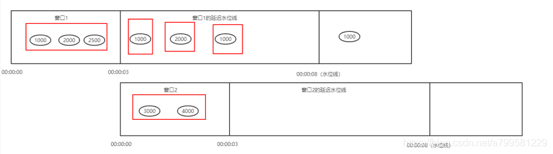
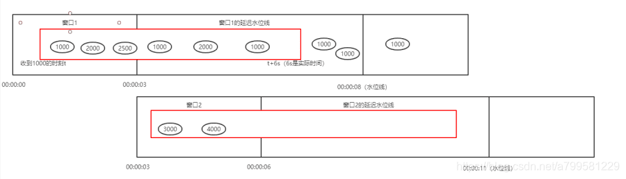
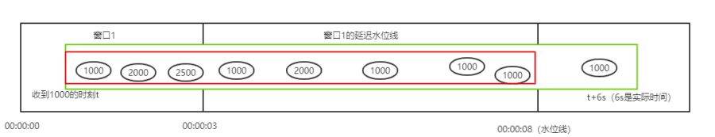
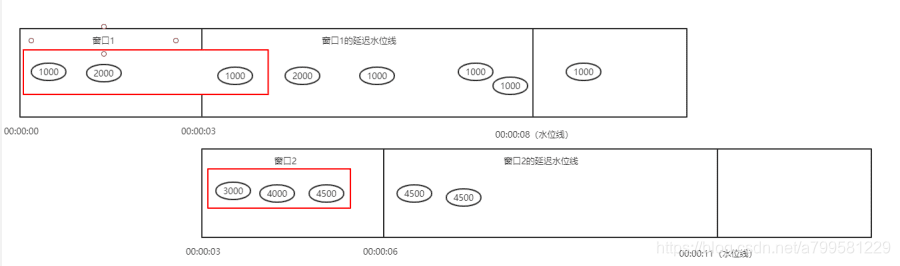
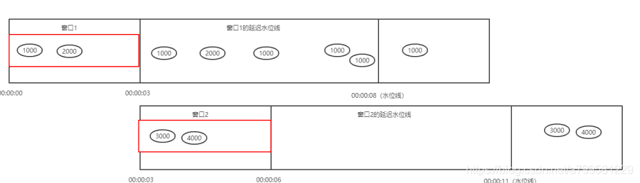
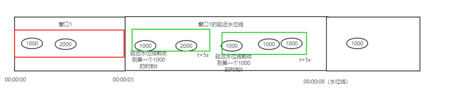
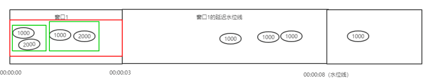

# apache beam 入门之触发器

引用: https://blog.csdn.net/a799581229/article/details/106697108
- [apache beam介绍](https://blog.csdn.net/a799581229/article/details/106392560)
- [apache beam入门使用](https://blog.csdn.net/a799581229/article/details/106392569)
- [apache beam入门之初次使用](https://blog.csdn.net/a799581229/article/details/106411943)
- [apache beam入门之程序入口——PipelineOption](https://blog.csdn.net/a799581229/article/details/106444527)
- [apache beam入门之pipeline 管道](https://blog.csdn.net/a799581229/article/details/106444620)
- [apache beam入门之输入输出SDK调用（批处理）](https://blog.csdn.net/a799581229/article/details/106504798)
- [apache beam入门之组装数据变换过程](https://blog.csdn.net/a799581229/article/details/106505003)
- [apache beam入门之数据聚合](https://blog.csdn.net/a799581229/article/details/106505003)
- [apache beam入门之group分组操作](https://blog.csdn.net/a799581229/article/details/106536446)
- [apache beam入门之数据集PCollection的拆分和合并](https://blog.csdn.net/a799581229/article/details/106536395)
- [apache beam入门之旁路输入](https://blog.csdn.net/a799581229/article/details/106557383)
- [apache beam入门之编码Coder相关](https://blog.csdn.net/a799581229/article/details/106558624)
- [apache beam入门之beam-sql](https://blog.csdn.net/a799581229/article/details/106580442)
- [apache beam KafkaIO的使用（流处理IO）](https://blog.csdn.net/a799581229/article/details/106587683)
- [apache beam入门之窗口概念](https://blog.csdn.net/a799581229/article/details/106590948)
- [apache beam入门之 窗口水位线和超时数据概念](https://blog.csdn.net/a799581229/article/details/106696188)
- [apache beam入门之触发器](https://blog.csdn.net/a799581229/article/details/106697108)

原文链接：https://blog.csdn.net/a799581229/article/details/106444576

## 概念
触发器指 窗口的触发策略， 即窗口何时可以把该窗口内收集到的数据向下发送。
而手动设定触发器可以让我们做到2件事：
- 在窗口时间内， 我可以实现多次触发而不是像默认那样仅仅在窗口结束时触发1次
- 我可以对延迟数据做特殊触发，而不是像默认那样，1收到延迟数据就触发。

## 触发器类型
- 1、默认触发器
  当 “当前时间” 超过了窗口右界，则触发1次， 同时在延迟水位线前，每收到延迟数据就会触发1次，如下图所示：
  
   **红色方框指代每次的触发**

- 2、处理时间触发器（针对真正意义上的处理时间）
  该触发器在窗口内收到第一个数据之后， 开启1个x秒的小窗口，收集这x秒内（注意这x秒是真正意义上的计算机运行时间，而不是输入时间戳上的时间）该窗口的数据，并进行触发。
  我设定处理触发时间为6秒，则第一次收到1000后， 会开启1个6s的窗口，beam会启动1个定时器，收集6秒内属于0~2999的数据。如下图所示： 
  
    
  如果beam的"当前时间"已经超过水位线， 及时定时器还没到6秒，也会立刻结束窗口并触发，如下图所示，**绿色是收到1000后的6s范围，红色是触发范围**：  
  
  
  处理时间触发器使用AfterProcessingTime.pastFirstElementInPane()生成，代码如下：
  ~~~java
  PCollection<String> pTimeStrByWindow = pTimeStr
      // 3s固定窗口
      .apply(Window.<String>into(FixedWindows.of(Duration.standardSeconds(3)))
              // 设定5s的延迟时间
              .withAllowedLateness(Duration.standardSeconds(5))
              // 累加方式，把之前该窗口内的数据合并到一起再计算一次
              .accumulatingFiredPanes()
              // 设定触发器
              .triggering(
                      // 处理时间触发器
                      AfterProcessingTime.pastFirstElementInPane()
                              // 窗口内当收到第1个数据后，开启1个6s的小触发窗口
                              // 触发后就不再接收该窗口数据。
                              .plusDelayOf(Duration.standardSeconds(6))));
  ~~~

- 3、数据处理个数触发器
  该触发器根据收集到的个数进行触发，在窗口内，如果收集到x个，则进行触发，后续不再做收集。 如果未收集到x个，但是已经到达了水位线，还是会触发
  假设我们设定x为3，则触发情况如下图所示，可以看到收集3个之后的不再收集： 
   
  
  代码示例如下：
  ~~~java
        PCollection<String> pTimeStrByWindow = pTimeStr
                // 3s固定窗口
                .apply(Window.<String>into(FixedWindows.of(Duration.standardSeconds(3)))
                        // 设定5s的延迟时间
                        .withAllowedLateness(Duration.standardSeconds(5))
                        // 累加方式，把之前该窗口内的数据合并到一起再计算一次
                        .discardingFiredPanes()
                        // 设定触发器
                        .triggering(
                                // 处理个数触发器，收集到至少3个或者到达水位线末尾触发
                                // 也是只触发1次
                                AfterPane.elementCountAtLeast(3)));
  ~~~

- 4、水位线触发器
  如果使用AfterWatermark.pastEndOfWindow()这个触发器，则会在窗口结束时立刻触发，而不会处理延迟数据，如下图所示：
  

  - 水位线触发器之处理延迟数据
  如果希望处理延迟数据， 需要再调用.withLateFirings(触发器对象) 来设定1个窗口右界->水位线之间的触发器。
  假设我们希望在 窗口->水位线之间， 收到延迟数据的话，则启动1个5s的处理时间触发器，则代码可以如下：
  ~~~java
  PCollection<String> pTimeStrByWindow = pTimeStr
          // 3s固定窗口
          .apply(Window.<String>into(FixedWindows.of(Duration.standardSeconds(3)))
                  // 设定5s的延迟时间
                  .withAllowedLateness(Duration.standardSeconds(5))
                  // 累加方式，把之前该窗口内的数据合并到一起再计算一次
                  .discardingFiredPanes()
                  // 设定触发器
                  .triggering(
                          // 窗口结束马上触发
                          AfterWatermark.pastEndOfWindow()
                                  // 窗口结束到水位线之间，启用处理时间触发器
                                  // 如果收到1个延迟数据，就开启3s小窗口收集该窗口范围的数据
                                  // 并且是持续的，如果未过水位线
                                  // 只要收到1个延迟数据且小窗口已结束，就可以再次开始这个3s小窗口做触发
                                  .withLateFirings(
                                          AfterProcessingTime.pastFirstElementInPane()
                                                  .plusDelayOf(Duration.standardSeconds(5)))
                  ));
  ~~~
  与前文提到的不同， 在窗口触发器中用withLateFiring去设定延迟触发器时， 这个触发器在窗口内是持续性的而非一次性的，如下图所示,绿色是延迟触发器触发的延迟窗口数据：
  
  
  同理，我们也可以用withLateFirings来设定1个数据处理个数的延迟触发器，这个就不再举例。
  
  - 水位线触发器之在窗口结束前提前处理数据
  水位线触发器会在窗口结束(即00:00:03)时触发1次， 但是我如果希望在窗口结束前，也做一些特殊的触发， 即希望在结束前，每2个元素触发1次， 则可以写如下代码：
  ~~~java
  PCollection<String> pTimeStrByWindow = pTimeStr
          // 3s固定窗口
          .apply(Window.<String>into(FixedWindows.of(Duration.standardSeconds(3)))
                  // 设定5s的延迟时间
                  .withAllowedLateness(Duration.standardSeconds(5))
                  // 累加方式，把之前该窗口内的数据合并到一起再计算一次
                  .discardingFiredPanes()
                  // 设定触发器
                  .triggering(
                          // 窗口结束马上触发
                          AfterWatermark.pastEndOfWindow()
                                  // 窗口结束前，每2个元素收集1个小窗口并触发
                                  // 并且是持续性而非一次性的
                          .withEarlyFirings(AfterPane.elementCountAtLeast(2))
                  ));
  ~~~
  触发情况如下：
   
  该窗口在累积模式下会触发3次， 输出[1000,2000] [1000,2000,1000,2000] 和[1000,2000,1000,2000]
  
  水位线触发器可以将withEarlyFirings和withLateFirings二者一起使用，从而实现窗口内的连续性触发，以及延迟数据的连续触发。

- 5、复合触发器
  可以组合多个触发器来形成复合触发器，并且可以指定触发器的触发方式：重复发出结果，最多一次或其他自定义条件。Beam包括以下复合触发器：
  - 可以通过.withEarlyFirings和.withLateFirings向AfterWatermark.pastEndOfWindow添加额外的提前触发或延迟启动。

  - Repeatedly.forever指定一个永远重复执行的触发器。任何触发条件满足时，都会导致窗口发出结果，然后重置并重新开始。将Repeatedly.forever与.orFinally组合可以指定重复触发器停止的条件。

  - AfterEach.inOrder组合多个触发器以特定的顺序启动。每次序列中的触发器发出一个窗口，然后指向下一个触发器。

  - AfterFirst需要多个触发器，并且首次发出任何一个参数触发器都被满足。相当于多个触发器的逻辑OR运算。

  - AfterAll需要多个触发器，并在其所有参数触发器都满足时发出。相当于多个触发器的逻辑AND运算。

  - orFinally 可以作为最后的条件，引起任何触发器最后一次启动，再也不能再次触发。

  例如，希望每当窗格至少有100个元素或每1分钟触发1次。 则触发器可以设定如下：
  ~~~JAVA
  Repeatedly.forever(AfterFirst.of(
        AfterPane.elementCountAtLeast(100),
        AfterProcessingTime.pastFirstElementInPane().plusDelayOf(Duration.standardMinutes(1))))
  ~~~