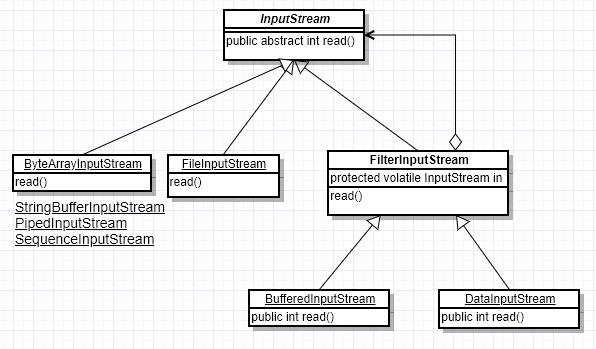
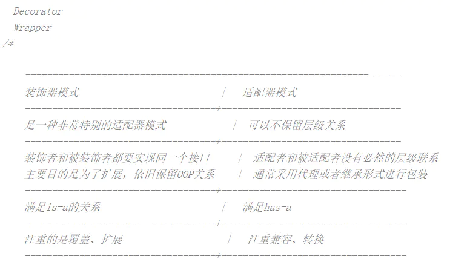

# 装饰着模式
## 概念
动态地将责任附加到对象上。若要扩展功能，装饰者提供了比继承更有弹性的替代方案。
简言之，对已存在的某些类进行装饰，以此来扩展某些功能

## 解决的问题

## 模式中的角色
- ### Component
  Component是一个接口或者抽象类，是定义我们最核心的对象，也可以说是最原始的对象
- ### ConcretComponent
  ConcreteComponent是最核心、最原始、最基本的接口或抽象类Component的实现，可以单独用，也可将其进行装饰
- ### Decorator
  一般是一个抽象类，继承自或实现Component，在它的属性里面有一个变量指向Component抽象构件，这是装饰器最关键的地方。
- ### ConcreteDecorator
  ConcreteDecoratorA和ConcreteDecoratorB是两个具体的装饰类，它们可以把基础构件装饰成新的东西，以此来扩展某些新功能类

## 解决的问题
- 1.需要扩展一个类的功能，给一个类附加责任。
- 2.动态的给一个对象附加功能，这些功能可以动态的撤销。
- 3.需要增加由一些基本功能的排列组合而产生的非常大量的功能。

## 装饰器模式在Java I/O系统中的实现

InputStream作为抽象构件，其下面大约有如下几种具体基础构件，从不同的数据源产生输入：
- ByteArrayInputStream，从字节数组产生输入；
- FileInputStream，从文件产生输入；
- StringBufferInputStream，从String对象产生输入；
- PipedInputStream，从管道产生输入；
- SequenceInputStream，可将其他流收集合并到一个流内；
FilterInputStream作为装饰器在JDK中是一个普通类，其下面有多个具体装饰器比如BufferedInputStream、DataInputStream等。我们以BufferedInputStream为例，使用它就是避免每次读取时都进行实际的写操作，起着缓冲作用。我们可以在这里稍微深入一下，站在源码的角度来管中窥豹。

## 总结
#### 装饰模式的优点：
- 装饰类和被装饰类可以独立发展，而不会相互耦合。换句话说，Component类无需知道Decorator类，Decorator类是从外部来扩展Component类的功能，而Decorator也不用知道具体的构件。
- 装饰器模式是继承关系的一个替代方案。我们看装饰类Decorator，不管装饰多少层，返回的对象还是Component(因为Decorator本身就是继承自Component的)，实现的还是is-a的关系。
- 装饰模式可以动态地扩展一个实现类的功能，比如在I/O系统中，我们直接给BufferedInputStream的构造器直接传一个InputStream就可以轻松构件一个带缓冲的输入流，如果需要扩展，我们继续“装饰”即可。
-（1）装饰模式与继承关系的目的都是要扩展对象的功能，但是装饰模式可以提供比继承更多的灵活性。装饰模式允许系统动态决定“贴上”一个需要的“装饰”，或者除掉一个不需要的“装饰”。继承关系则不同，继承关系是静态的，它在系统运行前就决定了。
-（2）通过使用不同的具体装饰类以及这些装饰类的排列组合，设计师可以创造出很多不同行为的组合。

#### 装饰模式的缺点：
多层的装饰是比较复杂的。 就像剥洋葱一样，剥到最后才发现是最里层的装饰出现了问题，可以想象一下工作量。
这点从我使用Java I/O的类库就深有感受，我只需要单一结果的流，结果却往往需要创建多个对象，一层套一层，对于初学者来说容易让人迷惑。

由于使用装饰模式，可以比使用继承关系需要较少数目的类。使用较少的类，当然使设计比较易于进行。但是，在另一方面，使用装饰模式会产生比使用继承关系更多的对象。更多的对象会使得查错变得困难，特别是这些对象看上去都很相像。

