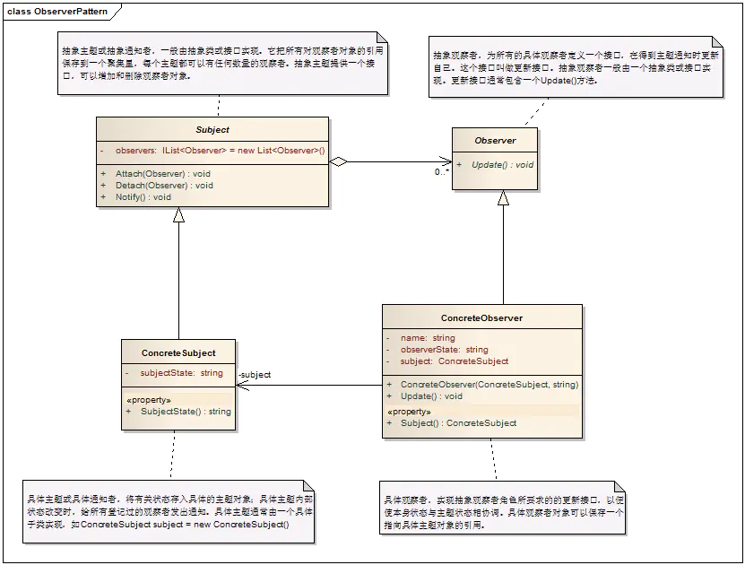

# 观察者模式

## 1. 概述
观察者模式定义了一种一对多的依赖关系，让多个观察者对象同时监听某一个主题对象。当这个主题对象在状态发生变化时，会通知所有观察者对象，使它们能够自动更新自己。
- 观察者模式把这多个订阅者称为观察者：Observer
- 多个观察者观察的对象被称为目标：Subject
## 2. 解决的问题
将一个系统分割成一个一些类相互协作的类有一个不好的副作用，那就是需要维护相关对象间的一致性。我们不希望为了维持一致性而使各类紧密耦合，这样会给维护、扩展和重用都带来不便。观察者就是解决这类的耦合关系的
## 3. 模式中的角色
###3.1 抽象主题（Subject）：
它把所有观察者对象的引用保存到一个聚集里，每个主题都可以有任何数量的观察者。抽象主题提供一个接口，可以增加和删除观察者对象。
- 1. 一个目标可以被多个观察者观察； 
     
   只有观察者依赖于目标，而目标是不会依赖于观察者的。
   
- 2. 目标提供对观察者注册和退订的维护；
- 3. 当目标的状态发生变化时，目标负责通知所有注册的、有效的观察者；

### 3.2 具体主题（ConcreteSubject）：
将有关状态存入具体观察者对象，在具体主题内部状态改变时，给所有登记过的观察者发出通知。

### 3.3 抽象观察者（Observer）：
为所有的具体观察者定义一个接口，在得到主题通知时更新自己。

### 3.4 具体观察者（ConcreteObserver）：
实现抽象观察者角色所要求的更新接口，以便使本身的状态与主题状态协调。

### 4. 模式解读
#### 4.1 观察者模式的类图

### 5. 模式总结
#### 5.1 观察者模式的优点
 - 观察者模式实现了观察者和目标之间的抽象耦合

    目标只是知道观察者接口，并不知道具体的观察者的类，从而实现目标类和具体的观察者类之间解耦。

 - 观察者模式实现了动态联动

   由于观察者模式对观察者注册实行管理，那就可以在运行期间，通过动态的控制注册的观察者，来控制某个动作的联动范围，从而实现动态联动。
   
 - 观察者模式支持广播通信

   由于目标发送通知给观察者是面向所有注册的观察者，所以每次目标通知的信息就要对所有注册的观察者进行广播。当然，也可以通过在目标上添加新的功能来限制广播的范围。
   在广播通信的时候要注意一个问题，就是相互广播造成死循环的问题。比如A和B两个对象互为观察者和目标对象
#### 5.2 观察者模式的缺点
 - 观察者模式可能会引起无谓的操作

   由于观察者模式每次都是广播通信，不管观察者需不需要，每个观察者都会被调用update方法，如果观察者不需要执行相应处理，那么这次操作就浪费了，有时甚至会造成误操作。

### 相关模式
#### 1、观察者模式和状态模式

   观察者模式和状态模式是有相似之处的。
   
   观察者模式是当目标状态发生改变时，触发并通知观察者，让观察者去执行相应的操作。而状态模式是根据不同的状态，选择不同的实现，这个实现类的主要功能就是针对状态的相应的操作，它不像观察者，观察者本身还有很多其它的功能，接收通知并执行相应处理只是观察者的部分功能。
   
   当然观察者模式和状态模式是可以结合使用的。观察者模式的重心在触发联动，但是到底决定哪些观察者会被联动，这时就可以采用状态模式来实现了，也可以采用策略模式来进行选择需要联动的观察者。
   

#### 2、观察者模式和中介者模式

   观察者模式和中介者模式是可以结合使用的。
   
   前面的例子中目标都只是简单的通知一下，然后让各个观察者自己去完成更新就结束了。如果观察者和被观察的目标之间的交互关系很复杂，比如：有一个界面，里面有三个下拉列表组件，分别是选择国家、省份/州、具体的城市，很明显这是一个三级联动，当你选择一个国家的时候，省份/州应该相应改变数据，省份/州一改变，具体的城市也需要改变。
   
   这种情况下，很明显需要相关的状态都联动准备好了，然后再一次性的通知观察者，就是界面做更新处理，不会国家改变一下，省份和城市还没有改，就通知界面更新。这种情况就可以使用中介者模式来封装观察者和目标的关系。

## 参考
- https://www.jianshu.com/p/aa7ee3c96986
- https://www.jianshu.com/u/657c611b2e07
- https://www.jianshu.com/p/daf1e9bc542f
- https://www.cnblogs.com/lovesong/p/5272752.html
- https://www.runoob.com/design-pattern/observer-pattern.html