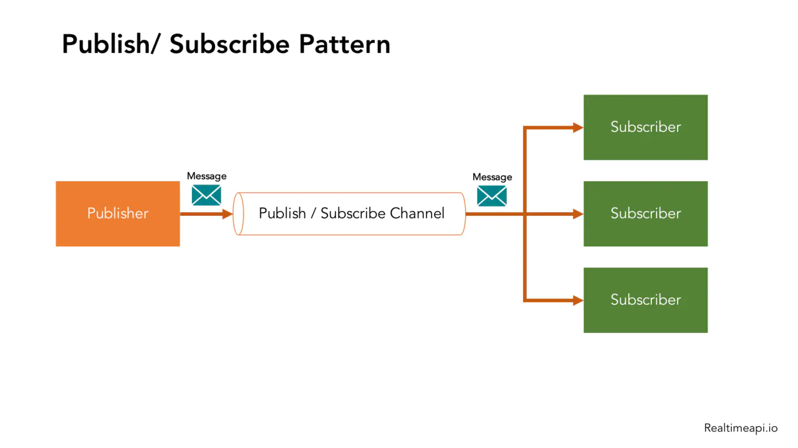

# 发布订阅模式
## 1. 概述
发布/订阅是一种消息范式，消息的发送者（称为发布者）不会将消息直接发送给特定的接收者（称为订阅者），而是通过消息通道广播出去，让订阅改消息主题的订阅者消费到。

## 2. 发布/订阅者模式的优点

- 松耦合/Independence
  
    发布/订阅者模式可以将众多需要通信的子系统(Subsystem)解耦，每个子系统都可以独立管理。而且即使部分子系统下线了，也不会影响系统消息的整体管理。
    发布/订阅者模式为应用程序提供了关注点分离。每个应用程序都可以专注于其核心功能，而消息传递基础结构负责将消息路由到每个消费者手里。

- 高伸缩性/Scalability
  
    发布/订阅者模式增加了系统的可伸缩性，并提高了发送者的响应能力。原因是发送方(Publisher)可以快速地向输入通道发送一条消息，然后返回到其核心处理职责，而不必等待子系统处理完成。然后消息传递的基础结构负责确保把消息传递到每个订阅者(Subscriber)手里。

- 高可靠性/Reliability
  
    发布/订阅者模式提高了可靠性。异步的消息传递有助于应用程序在增加的负载下继续平稳运行，并且可以更有效地处理间歇性故障。

- 灵活性/Flexibility
  
    你不需要关心不同的组件是如何组合在一起的，只要他们共同遵守一份协议即可。
    发布/订阅者模式允许延迟处理或者按计划的处理。例如当系统负载大的时候，订阅者可以等到非高峰时间才接收消息，或者根据特定的计划处理消息。

- 可测试性/Testability
  
    发布/订阅者模式提高了可测试性。通道可以被监视，消息可以作为整体集成测试策略的一部分而被检查或记录
