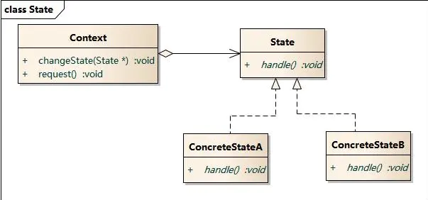
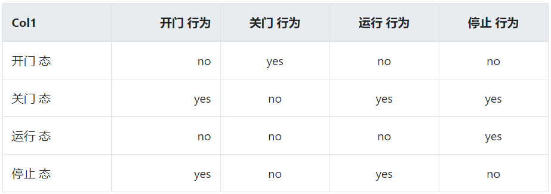

# 状态模式

## 1. 概述
允许一个对象在其内部状态改变时改变他的行为。对象看起来视乎改变了他的类。

## 2. 适用性:

1、一个对象的行为取决于它的状态，并且它必须在运行过程中可以根据它的状态改变它的行为；

2、一个操作中含有庞大的多分支的条件语句，并且这些分支依赖于该对象的状态；这个状态通常使用一个或多个枚举常量表示；通常，有多个操作包含这一相同的条件结构；State模式把每一个条件分支放入一个独立的类中；这使得你可以根据对象自身的情况把对象的状态作为一个对象，而且这一对象可以不依赖于其它对象而独立变化；

## 3. 状态模式包含的角色
- 环境类(Context)：
- 抽象状态类(State)：定义一个接口，以封装与Context的一个特定状态相关的行为。
- 具体状态类(ConcreteState)：每一子类实现一个与Context的一个状态相关的行为

    示例图: 

## 3. 示例
电梯有四种状态：开门、关门、运行、停止。

## 4. 优缺点默哀书
### 4.1 优点
-  1、封装了转换规则。 
-  2、枚举可能的状态，在枚举状态之前需要确定状态种类。 
-  3、将所有与某个状态有关的行为放到一个类中，并且可以方便地增加新的状态，只需要改变对象状态即可改变对象的行为。 
-  4、允许状态转换逻辑与状态对象合成一体，而不是某一个巨大的条件语句块。 
-  5、可以让多个环境对象共享一个状态对象，从而减少系统中对象的个数。

### 4.2 缺点
-  1、状态模式的使用必然会增加系统类和对象的个数。 
-  2、状态模式的结构与实现都较为复杂，如果使用不当将导致程序结构和代码的混乱。 
-  3、状态模式对"开闭原则"的支持并不太好，对于可以切换状态的状态模式，增加新的状态类需要修改那些负责状态转换的源代码， 否则无法切换到新增状态，而且修改某个状态类的行为也需修改对应类的源代码。

##  关键代码

状态模式的接口中有一个或者多个方法。而且，状态模式的实现类的方法，一般返回值，或者是改变实例变量的值。也就是说，状态模式一般和对象的状态有关。实现类的方法有不同的功能，覆盖接口中的方法。状态模式和命令模式一样，也可以用于消除 if...else 等条件选择语句。