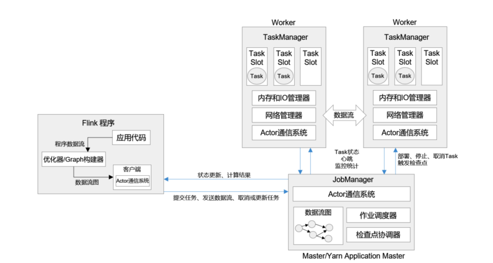
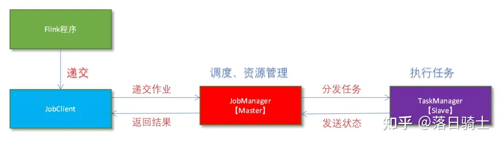

# Apache Flink分布式集群安装

https://blog.csdn.net/qq_58056343/article/details/130750972
https://zhuanlan.zhihu.com/p/627906342

Apache Flink是一个框架和分布式处理引擎，用于对无界数据和有界数据流进行状态计算。Flink被设计为在所有常见的集群环境中运行，以内存中的速度和任何规模执行计算。

## 1、Flink系统架构
Flink的运行时架构中，最重要的就是两大组件：作业管理器（JobManger）和任务管理器（TaskManager）。对于一个提交执行的作业，JobManager是真正意义上的“管理者”（Master）, 负责管理调度，所以在不考虑高可用的情况下只能有一个；而TaskManager是“工作者”（Worker、Slave）, 负责执行任务处理数据，所以可以有一个或多个。

客户端并不是处理系统的一部分，它只负责作业的提交。具体来说，就是调用程序的 main 方法，将代码转换成“数据流图”（Dataflow Graph），并最终生成作业图（JobGraph），一并发送给 JobManager。提交之后，任务的执行其实就跟客户端没有关系了；

## 1、 基础环境安装
Flink既可以自己运行，也可以在几个现有的集群管理器上运行。它目前提供了几个部署选项： 
- local模式：  本地模式;
- Standalone:  独立模式，Flink伪分布环境集群（开发测试环境），Standalone模式中Flink的各个角色都是独立的进程。
- standaloneHA： 独立集群高可用模式，Flink自带集群，开发测试环境使用。
- Apache Mesos:（已弃用） 一个通用的集群管理器，也可以运行HadoopMapReduce和服务应用程序。
- Hadoop YARN： Hadoop3中的资源管理器。运行在 yarn 资源管理器框架之上，由 yarn 负责资源管理，Flink负责任务调度和计算。
- Kubernetes：

### 1.1 安全
默认情况下，不会启用身份验证等安全功能，在部署一个集群时，对internet或不受信任的网络是开开放的。
确保对群集的访问安全以防止未经授权的应用程序在群集上运行非常重要。

### 1.2 安装JAVA
Flink在Java 8/11/17、Scala 2.12。
~~~ shell
# 检查系统自带java，如果版并不符合则卸载
yum -y list java*
yum list installed | grep java
yum -y remove java-1.*
yum -y remove tzdata-java.noarch
yum -y remove javapackages-tools.noarch
~~~
# 安装1.8版本的JDK
## https://www.oracle.com/cn/java/technologies/downloads/
~~~ shell
tar -zvxf /soft/jdk-8u381-linux-x64.tar.gz -C /usr/local/
mv /usr/local/jdk1.8.0_381 /usr/local/java
mv /usr/local/jdk1.8.0_381 /usr/local/java

#配置环境变量
[root@ef69bca31ddb ~]cat /etc/profile
# 编辑vi /etc/profile，在最后增加
export JAVA_HOME=/usr/local/java
export CLASSPATH=.:$JAVA_HOME/lib/dt.jar:$JAVA_HOME/lib/tools.jar:$JAVA_HOME/jre/lib/rt.jar
export PATH=$PATH:$JAVA_HOME/bin
---
[root@ef69bca31ddb ~]source /etc/profile
[root@ef69bca31ddb ~]# java -version
java version "1.8.0_381"
Java(TM) SE Runtime Environment (build 1.8.0_381-b09)
Java HotSpot(TM) 64-Bit Server VM (build 25.381-b09, mixed mode)
[root@ef69bca31ddb ~]#
[root@ef69bca31ddb ~]# whereis java
java: /usr/local/java /usr/local/java/bin/java
[root@ef69bca31ddb ~]
~~~

### 1.2 安装Flink
- **下载Flink包**
~~~ html
Download Apache flink™: https://flink.apache.org/downloads/
https://www.apache.org/dyn/closer.lua/flink/flink-1.19.0/flink-1.19.0-bin-scala_2.12.tgz
~~~
- **安装Flink包**
~~~shell
[root@data-master01 ~]# tar -zxf /soft/flink-1.19.0-bin-scala_2.12.tgz -C /usr/local/
[root@data-master01 ~]# mv /usr/local/flink-1.19.0 /usr/local/flink1.19.0
[root@data-master01 ~]# vi /etc/profile
# 添加如下内容
export FLINK_HOME=/usr/local/spark
export PATH=$PATH:$FLINK_HOME/bin

[root@data-master01 ~]# source /etc/profile
[root@data-master01 ~]# flink -v
[root@data-master01 ~]# Version: 1.19.0, Commit ID: eaffd22
~~~
分发文件config.yaml、masters和workers到data-worker01和data-worker02环境
本Flink环境提供3个服务节点，主节点：data-master01，从节点：data-worker01和data-worker02
~~~
[root@data-master01 local]# cd /usr/local
[root@data-master01 local]# scp -r flink1.19.0/ data-worker01:/usr/local/
[root@data-master01 local]# scp -r flink1.19.0/ data-worker02:/usr/local/
~~~

## 2、 Flink集群搭建
### 2.1 本地集群模式

- Flink程序需要提交给JobClient 
- JobClient将作业提交给JobManager 
- JobManager负责协调资源分配和作业执行。资源分配完成后，任务将提交给相应的TaskManager 
- TaskManager启动一个线程以开始执行。TaskManager会向JobManager报告状态更改。例如开始执行，正在进行或已完成。 
- 作业执行完成后，结果将发送回客户端（JobClient） 

#### **启动一个本地cluster**
修改配置文件(config.yaml):  
- jobmanager.rpc.address=localhost

~~~shell
# Flink 进程的启动参数
[root@data-master01 ~]# start-cluster.sh
Starting cluster.
Starting standalonesession daemon on host data-master01.
Starting taskexecutor daemon on host data-master01.
[root@data-master01 ~]# ps aux | grep flink
root        3644  0.0  0.1   6636  2196 pts/0    S+   23:24   0:00 grep --color=auto flink
# jps查看进程信息
[root@data-master01 ~]# jps
3120 TaskManagerRunner
3185 Jps
2606 StandaloneSessionClusterEntrypoint
[root@data-master01 ~]#
~~~

- **运行一个flink程序验证**
使用flink命令运行，单词统计的例子。启动： start-cluster.sh； 关闭： stop-cluster.sh
~~~ shell
[root@data-master01 ~]# flink run $FLINK_HOME/examples/streaming/WordCount.jar
Executing example with default input data.
Use --input to specify file input.
Printing result to stdout. Use --output to specify output path.
Job has been submitted with JobID cc2033ec191e9002743a09fccba6bac6
Program execution finished
Job with JobID cc2033ec191e9002743a09fccba6bac6 has finished.
Job Runtime: 909 ms

[root@data-master01 ~]#
[root@data-master01 ~]# cd /usr/local/flink1.19.0/
[root@data-master01 flink1.19.0]# tail log/flink-*-taskexecutor-*.out
(nymph,1)
(in,3)
(thy,1)
(orisons,1)
(be,4)
(all,2)
(my,1)
(sins,1)
(remember,1)
(d,4)
[root@data-master01 flink1.19.0]#
~~~
浏览器验证：http://192.168.0.40:8081/

### 2.2 standalone模式
自身节点运行的模式，也称为独立部署模式，修改配置文件(config.yaml):  
- jobmanager.rpc.address=data-master01

修改masters，workers文件，内容如下
~~~shell
[root@data-master01 ~]# vi $FLINK_HOME/conf/masters
[root@data-master01 ~]# cat $FLINK_HOME/conf/masters
data-master01:8081
[root@data-master01 ~]# vi $FLINK_HOME/conf/workers
[root@data-master01 ~]# cat $FLINK_HOME/conf/workers
data-worker01
data-worker02
[root@data-master01 ~]#
~~~
同步文件config.yaml、masters和workers到data-worker01和data-worker02环境
~~~shell
[root@data-master01]#
scp -r $FLINK_HOME/conf/workers data-worker01:$FLINK_HOME/conf/masters
scp -r $FLINK_HOME/conf/workers data-worker01:$FLINK_HOME/conf/workers
scp -r $FLINK_HOME/conf/config.yaml data-worker01:$FLINK_HOME/conf/config.yaml
scp -r $FLINK_HOME/conf/workers data-worker02:$FLINK_HOME/conf/masters
scp -r $FLINK_HOME/conf/workers data-worker02:$FLINK_HOME/conf/workers
scp -r $FLINK_HOME/conf/config.yaml data-worker02:$FLINK_HOME/conf/config.yaml
~~~

- 启动standalone模式集群
~~~
[root@data-master01 ~]# start-cluster.sh
Starting cluster.
Starting standalonesession daemon on host data-master01.
Starting taskexecutor daemon on host data-worker01.
Starting taskexecutor daemon on host data-worker02.
[root@data-master01 ~]#
[root@data-master01 ~]# jps
3120 TaskManagerRunner
5169 StandaloneSessionClusterEntrypoint
5257 Jps
[root@data-master01 ~]#
[root@data-master01 ~]# ssh data-worker01
Activate the web console with: systemctl enable --now cockpit.socket

Last login: Mon Apr  8 23:45:36 2024 from 192.168.0.150
[root@data-worker01 ~]# jps
2965 TaskManagerRunner
3063 Jps
[root@data-worker01 ~]#
~~~
启动flink standalone集群后，可以使用flink client向该集群master节点提交任务
~~~shell
[root@data-worker01 ~]# flink run -m data-master01:8081 $FLINK_HOME/examples/streaming/WordCount.jar
Executing example with default input data.
Use --input to specify file input.
Printing result to stdout. Use --output to specify output path.
Job has been submitted with JobID 8c19518628d2173a95705d5f83160d05
Program execution finished
Job with JobID 8c19518628d2173a95705d5f83160d05 has finished.
Job Runtime: 529 ms

[root@data-worker01 ~]#
[root@data-worker01 ~]# tail $FLINK_HOME/log/flink-*-taskexecutor-*.out
==> /usr/local/flink1.19.0/log/flink-root-taskexecutor-0-data-master01.out <==
(nymph,1)
(in,3)
(thy,1)
(orisons,1)
(be,4)
(all,2)
(my,1)
(sins,1)
(remember,1)
(d,4)

==> /usr/local/flink1.19.0/log/flink-root-taskexecutor-0-data-worker01.out <==
[root@data-worker01 ~]#
~~~
确认standalone：
http://data-master01:8081/

### 2.3 YARN 模式
在完成flink standalone集群部署后，使用Yarn模式提交作业，flink on yarn不需要启动flink集群，只需要启动hadoop集群即可。
一般推荐2台主节点，3台从节点
在测试官方案例之前，需要在flink-conf.yaml文件添加：
