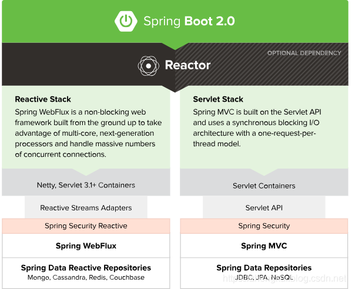

# **What’s Spring WebFlux**
让我们来看下官方英文怎么介绍的，有兴趣的也可以看一下spring官方的web-react。

    The original web framework included in the Spring Framework, Spring Web MVC, was purpose-built for the Servlet API and Servlet containers.
    The reactive-stack web framework, Spring WebFlux, was added later in version 5.0. It is fully non-blocking, supports Reactive Streams back
    pressure, and runs on such servers as Netty, Undertow, and Servlet 3.1+ containers.
####
    Both web frameworks mirror the names of their source modules (spring-webmvc and spring-webflux) and co-exist side by side 
    in the Spring Framework. Each module is optional. Applications can use one or the other module or, in some cases, 
    both — for example, Spring MVC controllers with the reactive WebClient.

Spring MVC是Spring Framework中包含的原始Web框架，也是专为Servlet API和Servlet容器构建的Web框架。

响应式堆栈Web框架是[Spring WebFlux](https://docs.spring.io/spring-framework/docs/current/reference/html/web-reactive.html#spring-webflux) 是在Spring5版才有的， 是一个完全是非阻塞编程，支持Reactive Streams响应流，并且可以很好运行在Netty，Undertow和Servlet 3.1+容器等服务器上（言外之意，开发人员可以使用 WebFlux 创建高性能 的 Web 应用和客户端）。

这两个Web框架都反映了其源模块的名称（spring-webmvc和spring-webflux），并在Spring Framework中并存。 每个模块都是可选的。 应用程序可以使用一个或另一个模块，或者在某些情况下，两者都混合使用，例如在MVC的Controller中带有反应式WebClient。

 

## **接下来，我们一起搞清楚几个问题:**
- 1、关于Reactive Streams、Srping Reactor 和 Spring WebFlux之间的关系
  
  [Reactive Streams](https://www.reactive-streams.org) 是规范，Srping Reactor 实现了 Reactive Streams。Spring WebFlux 是以 Reactor 为基础，实现 Web 领域的反应式编程框架。
      
- 2、反应式编程思想是什么？Backpressure背压又是什么？

   反应式编程框架主要采用了观察者模式，而 Spring Reactor 的核心则是对观察者模式的一种延伸。观察者模式的架构中被观察者(Observable)和观察者(Subscriber)处在不同的线程环境中时，由于者各自的工作量不一样，导致它们产生事件和处理事件的速度不一样，这时就出现了两种情况：

    - Controller被观察者处理事件慢一些，Client/Browser观察者处理在等啊等。那么Client/Browser观察者就会等着被观察者Controller响应事件，例如排队卖烧饼，被观察者在卖，观察者在买，没问题吧，典型的。
    - Controller被观察者处理事件的速度很快，而Client/Browser观察者处理很慢（客户端忙，服务器想响应给你，你都无法接收）。那就有点问题了，如果不作处理的话，事件会堆积起来，最终挤爆你的内存，导致程序崩溃，生产一堆烧饼等人买？
    - 这时就出现了Backpressure（背压-----指在异步场景中，被观察者Controller发送事件速度远快于Client/Browser观察者的处理速度的情况下，一种告诉上游的被观察者降低发送速度的策略）

- 3、既然Webflux不是基于Servlet，那么Spring Security等基于Servlet的组件可以用吗

    如果打算将 Web Flux 运行在 Servlet 容器之上，必须是支持 Servlet 3.1 以上，因为才有非阻塞NIO的支持，虽然 Web Flux 的 API 在某些地方，确实提供了NIO的选项，若单纯只是试着将基于 Web MVC 的应用程序，改写为套用 Web Flux，并不是十分出色的方案。
=。=
  例如，Spring Security 显然就不能用了，毕竟是 Spring 基于 Servlet 的安全方案，开发者必须想办法改造为 Spring Security Reactive；而且，在储存方案上，也不是直接采用 Spring Data，而是建议 Spring Data Reactive 等，因为现在整个生态都不完善，所以暂时不会有很多东西出来，但是肯定会慢慢完善。

- 4、如何更好的理解Mono和Flux

    - Mono / Flux 都是Publisher（发布者），也就是被观察者(Observable)。
    - Mono / Flux 都实现了 org.reactivestreams.Publisher<T> 接口，在 Web Flux，你的方法只需返回 Mono / Flux 即可。你的代码基本也只和 Mono 或 Flux 打交道。而 Web Flux 则会实现 Subscriber ，调用onNext()时将业务开发人员编写的 Mono/Flux 转换为 HTTP Response 返回给客户端。
    
## Springboot webFlux的开发
### 基于注解非常接近Spring MVC模型
-    示例: [CommonController.java]([../com/hanwj/sample/webflux/ctl/CommonController.java])
     请求接口：
     - curl -X GET http://localhost:8081/api/common/error/mono/1213
     - curl -H "Accept: application/json" -H "Content-type: application/json" -H "charset: UTF-8" -X POST -d "{"""id""":"""10001"""}" http://localhost:8081/api/common/mono/demo1 
       
### 路由配置与请求的实际处理分开

## 参考资料
- https://blog.csdn.net/moshowgame/article/details/97625255
- https://blog.csdn.net/xudc0521/article/details/88806533
- https://blog.csdn.net/xudc0521/article/details/88815387

